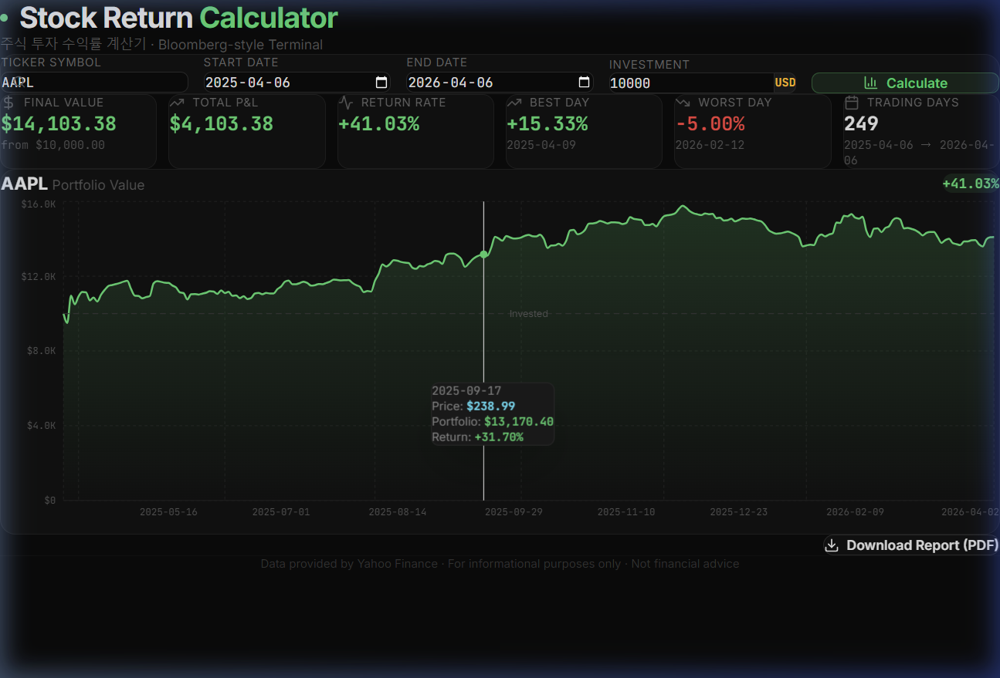

<div align="center">

# 📈 Stock Return Calculator

**주식 투자 수익률 계산기**

A Bloomberg terminal-inspired stock investment return calculator with PDF report generation.

[](https://react.dev/)
[](https://vitejs.dev/)
[](https://tailwindcss.com/)
[](https://vercel.com)
[](LICENSE)

**[🔗 Live Demo](https://stock-calculator.vercel.app)** · **[📄 배포 가이드](./DEPLOY.md)**

<br />



</div>

---

## ✨ Features

- 🗂️ **CSS Grid Widget Dashboard** — A stable, hardware-accelerated dashboard layout displaying the Main Calculator, DRIP Simulator, Portfolio Builder, and Future Forecast seamlessly on one screen.
- 🔮 **Monte Carlo Future Forecast** — Projections of future portfolio values based on historical volatility and drift using Monte Carlo simulations.
- 🧺 **Multi-Asset Portfolio Builder** — Backtest a custom basket of up to 5 assets with specified weights (Buy & Hold) tracking actual asset drift over time.
- 💸 **DRIP Simulator** — Visualize dividend compounding by automatically reinvesting custom dividend yields.
- 🔍 **Stock Ticker Search** — Supports global tickers (e.g. `AAPL`, `TSLA`, `005930.KS`)
- 📅 **Date Range & Presets** — Pick custom start/end dates or use quick presets (1M, YTD, 1Y, MAX, etc.)
- 🔄 **Investment Mode Toggle** — Switch between **Lump Sum** and **DCA** (Dollar Cost Averaging) strategies
- 📈 **Benchmark Comparison** — Compare stock performance against major indices (S&P 500, NASDAQ, Dow Jones, KOSPI) or custom tickers
- 🗓️ **Monthly Returns Heatmap** — Professional Bloomberg-style monthly/yearly returns heatmap matrix
- 🗄️ **Historical Data Table** — Detailed daily data table with **CSV Export** functionality
- 🪙 **Currency Toggle & Crypto** — Switch between `USD` and `KRW`, with full support for cryptocurrency decimals
- 📊 **Interactive Dual-Axis Chart** — Recharts-powered area and line charts featuring merged DCA lines, hover tooltips, and secondary Y-axis.
- 🌍 **Macro-Economic Overlays** — Compare stock performance directly against key macro indicators (e.g., 10-Yr Treasury Yield `^TNX`, VIX `^VIX`, US Dollar Index `DX-Y.NYB`).
- 📋 **Advanced Summary Cards** — Final value, Total P&L, Best/Worst day, Max Drawdown, and Sharpe Ratio
- 🔗 **Shareable Links** — Easily share your portfolio configuration via custom URL parameters
- 📄 **PDF Report Export** — Generates bilingual PDF (Korean 🇰🇷 + English 🇺🇸) with chart & analysis
- 🖥️ **Bloomberg Terminal Theme** — Dark mode, monospace fonts, terminal aesthetics
- 📱 **Responsive Layout** — Works seamlessly across desktop and mobile devices

## 🛠️ Tech Stack

| Technology | Purpose |
|---|---|
| [React 19](https://react.dev/) | UI Framework |
| [Vite 8](https://vitejs.dev/) | Build Tool |
| [Tailwind CSS 4](https://tailwindcss.com/) | Styling |
| [Recharts](https://recharts.org/) | Chart Visualization |
| [jsPDF](https://github.com/parallax/jsPDF) | PDF Generation |
| [html2canvas](https://html2canvas.hertzen.com/) | HTML to Image Capture |
| [Lucide React](https://lucide.dev/) | Icons |

## 📡 Data Source

- **Yahoo Finance** unofficial API (`/v8/finance/chart/`)
- **CORS Proxy** via [corsproxy.io](https://corsproxy.io/) to avoid browser blocking
- No backend required — runs entirely in the browser

## 🚀 Getting Started

### Prerequisites

- [Node.js](https://nodejs.org/) (v18+)
- npm

### Local Development

```bash
# Clone the repository
git clone https://github.com/YOUR_USERNAME/stock-calculator.git
cd stock-calculator

# Install dependencies
npm install

# Start development server
npm run dev
```

The app will be available at `http://localhost:5173/`

### Quick Start (Windows)

Double-click `run.bat` to automatically install dependencies and launch the app.

### 🌐 Deploy to Vercel

가장 쉬운 배포 방법입니다. 아래 버튼을 클릭하면 바로 배포됩니다:

[](https://vercel.com/new/clone?repository-url=https://github.com/YOUR_USERNAME/stock-calculator)

또는 수동으로:

```bash
# 1. Vercel CLI 설치
npm i -g vercel

# 2. 배포
vercel --prod
```

> 📖 자세한 배포 가이드는 [DEPLOY.md](./DEPLOY.md)를 참고하세요.

## 📄 PDF Report

The PDF report includes **two pages**:

| Page | Language | Contents |
|---|---|---|
| 1 | 🇰🇷 한국어 | 차트 이미지, 투자 요약 테이블, 분석 요약문 |
| 2 | 🇺🇸 English | Chart image, Investment summary table, Analysis paragraph |

## 📸 Screenshots

<details>
<summary>Click to expand</summary>

### Main Dashboard


### Summary Cards
- Final portfolio value with profit/loss
- Return rate with color coding
- Best & worst trading day
- Total trading days count

### Interactive Tooltip
Hover over the chart to see:
- Date
- Stock price
- Portfolio value
- Cumulative return %

</details>

## 📁 Project Structure

```
stock-calculator/
├── index.html          # Entry HTML
├── package.json        # Dependencies & scripts
├── vite.config.js      # Vite configuration
├── preview.png         # Preview screenshot
├── run.bat             # Windows quick launcher
└── src/
    ├── main.jsx        # React entry point
    ├── index.css       # Global styles & Tailwind config
    └── App.jsx         # Main application (all-in-one)
```

## ⚠️ Disclaimer

> This tool is for **informational purposes only** and does **not** constitute financial advice.  
> Data is sourced from Yahoo Finance's unofficial API and may be subject to rate limits or availability issues.

## 🤝 Contributing

Contributions are welcome! Feel free to open an issue or submit a pull request.

1. Fork the repository
2. Create your feature branch (`git checkout -b feature/amazing-feature`)
3. Commit your changes (`git commit -m 'Add amazing feature'`)
4. Push to the branch (`git push origin feature/amazing-feature`)
5. Open a Pull Request

## 💝 Support

If you find this project useful, consider supporting via crypto donation:

<a href="https://nowpayments.io/donation?api_key=b4c4c52c-26bb-4923-8ae6-31e420434fd1" target="_blank">
  
</a>

## 📝 License

This project is licensed under the MIT License - see the [LICENSE](LICENSE) file for details.

---

<div align="center">
  <sub>Built with ❤️ using React + Vite + Tailwind CSS</sub>
</div>
